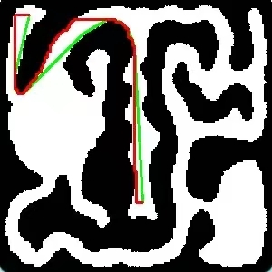

# florr-auto-pathing

A full desktop automation bot for [florr.io](https://florr.io/) (a Canvas
browser MMO). It drives a **fullscreen** florr.io tab in Chrome using real
OS-level mouse/keyboard (pyautogui), reads the in-game minimap with OpenCV,
runs A\* pathfinding over a fixed 300×300 walkability grid, optionally runs
YOLO enemy detection (ultralytics), injects JS into the game page over CDP,
and wraps everything in a customtkinter control-panel GUI.

The whole code stands on **CLIENT-SIDE** — nothing is injected into the game
server; the bot only moves the mouse the way a human would, and reads pixels
the way a human reads the screen.

This project is **welcomed** to be used in any other florr.io projects.

> ⚠️ **ToS risk:** automating florr.io likely violates its Terms of Service.
> Use a throwaway account. This bot has **no anti-detection** beyond what the
> browser naturally does — no humanized mouse curves, no random delays.

## Features

- **4 farmable maps** — `desert`, `ocean`, `anthell`, `garden` (all with
  pre-calibrated wall colors, player-marker colors, and server biomes).
- **Two farming modes**:
  - **随机区域 (random area)** — frame a rectangle on the map; the bot wanders
    continuously inside it, never standing still.
  - **固定路径 (fixed path)** — click a polyline on the map; the bot walks the
    path point-by-point and loops back to the start after the last point
    (the path's first point is the target point).
- **A\* pathfinding** with wall-keepout cost — paths prefer wide corridors but
  still squeeze through narrow ones; no corner-cutting; collision-with-wall
  anti-stuck escape.
- **Automatic respawn** — on death / start menus it clicks continue/start and
  starts a new round automatically.
- **Teleport recovery (传送门逃生)** — if the bot is teleported to garden by a
  portal, it pathfinds to the garden portal and walks back to the original map.
- **Auto server-switch** — on repeated short rounds, queries florr.io's
  official server API and switches to a fresh server (disabled on anthell,
  where switching crashes the game).
- **AFK popup handling** — coexists with an external florr-auto-afk program to
  dismiss AFK checks so the two don't fight over the mouse.
- **Enemy detection AI** (desert only, optional) — YOLO detects 6 mob species,
  reads rarity from name-tag color, flees from dangerous ones, chases Mythic+
  targets, kites them per-species.
- **Shortcut learning** — `learn_shortcuts.py` carves hidden map shortcuts
  (passages not drawn on the minimap) into any map's walkability template.
- **Status overlay** — click-through, always-on-top HUD showing current state.

## The Lazy Theta Star

After I used `a*` pathing for a few months, I found this method caused a lot
of time wasting on collision with florr's walls, I quickly turned to use
`lazyθ*`. And here's the differences (Green for lazy_theta_star and Red for
a_star)



*(The current codebase uses the A\* variant ported from the sibling
`my-auto-pathing-system/pathfinder.py` — see "Architecture" below.)*

## Getting started

```bash
# Python 3.11 REQUIRED (the pinned torch<2.3 has no wheels for 3.12+)
python -m venv venv
venv\Scripts\activate
pip install -r requirements.txt
```

Then:

```bash
python main.py                    # open the control-panel GUI (normal entry point)
```

The GUI lets you:

- 选地图 (select map: desert / ocean / anthell / garden)
- 刷怪方式 (pick 随机区域 or 固定路径)
- 点目标点 (click a target point on the map)
- 框刷怪区 (frame a farming area with drag-select) — 随机区域 mode
- 画固定路径 (left-click to draw the farming path, right-click to undo a
  point) — 固定路径 mode
- 刷怪时长 (farming duration in seconds)
- 切敌检 (toggle enemy detection AI — off by default, needs `models/desert.pt`)
- 切 AFK (toggle auto-AFK detection)
- 连续短局阈值 + 自动换服务器 (auto server-switch settings)
- 一键启停 (click 开始 to start a farming run, or stop if already running)

Clicking 开始 spawns a worker subprocess that runs the actual pathfinding
loop. Worker logs appear in the GUI's log box in real time — no separate
console window.

### CLI worker mode

If you already have a ready Chrome instance (launched with the three CDP
flags — see [cdp_bridge.py](cdp_bridge.py)), you can skip the GUI and run the
bot loop directly:

```bash
python main.py --worker
```

This is equivalent to clicking 开始 in the GUI, but it **does not** launch or
prepare Chrome — the GUI owns all interactive setup.

## Maps

To decide on the positions and areas, I've already prepared `map_select.py`
and `area_select.py` for you:

> \> python3 map_select.py # And you click anywhere you want on the map
>
> Map position: (53, 144)

> \> python3 area_select.py # And you first click on the left_top bound, next click on the right_bottom bound.
>
> Area added: [(6, 5), (40, 44)]
> Final areas: [[(6, 5), (40, 44)], [(1, 43), (27, 87)]]

Map templates are fixed 300×300 PNGs in `maps/` (`desert.png`, `ocean.png`,
`anthell.png`, `garden.png`) — the same grid the pathfinder and player
position detection work in.

## Learning hidden shortcuts

Some maps have hidden passages that are **not** drawn on the minimap template,
so a player walking through one reads as "inside a wall" to the pathfinder.
Run this live-fire tool with the game open on that map, then manually walk the
shortcut once:

```bash
python learn_shortcuts.py            # default: anthell
python learn_shortcuts.py desert     # or any map in maps/
```

It polls the *raw* player marker, detects in-wall positions, and carves the
walked wall segments into the map's PNG (a Bresenham line between consecutive
samples), saving after each step. Ctrl+C to exit. The committed `anthell.png`
has already been carved this way.

## Enemy Detection (Sandstorm Zone)

`auto_farming()` can chase/avoid mobs by rarity using a YOLO model. This needs
`models/desert.pt` (6 classes: scorpion, beetle, cactus, sandstorm,
sand_centipede, soldier_fire_ant) placed at that exact path — it's not
included in this repo (third-party binary weights, gitignored). Get it from
[Shiny-Ladybug/assets](https://github.com/Shiny-Ladybug/assets) yourself and
verify its source before use; whoever/whatever wires this up should not be
downloading and loading arbitrary `.pt` files from the internet without a
human confirming that step (`.pt` files are pickle-based and can execute
code on load). See
`docs/superpowers/specs/2026-08-16-sszone-enemy-detection-design.md` for the
full design and the rarity-color-table caveats.

Enemy AI is **desert-only** for now — the bot auto-disables it on other maps
(no model weights for them yet) and when `models/desert.pt` is missing.

## Architecture

### Process model (GUI → worker)

- `python main.py` (no args) → `gui_app.py`. The GUI never runs bot logic.
  On 开始 it validates inputs, ensures the dedicated Chrome via dialogs,
  asks you to F11-fullscreen florr.io, writes `config.json`, then spawns
  `python main.py --worker` and streams its stdout into the log box.
- **Stop = close the worker's stdin pipe.** The worker watches stdin; on EOF
  it releases any held keys (so WASD/space don't stay stuck down) and exits.
  In the packaged `console=False` exe, this is the only reliable stop signal.
- Worker loop (`run_worker`): on death/menu screens it clicks the
  continue/start buttons and starts a new round automatically.

### Coordinate spaces (never mix them)

1. **Minimap space** — a fixed 300×300 grid, same as `maps/*.png`. Used for
   pathfinding, player position, farming areas/paths. `map_select.py` /
   `area_select.py` / `gui_map_picker.py` produce coordinates in this space.
2. **Screen space** — physical pixels. All UI constants were measured at
   1920×1080 and are scaled at runtime by `scale_x`/`scale_y`/`mouse_scale()`
   in `utils.py`. `get_player_position()` and pathing produce minimap coords;
   `enemy_detect`'s aim/flee helpers and `move_to_position`'s cursor math
   produce screen coords.

### Key modules

- `main.py` — the worker: pathfinding (A\* with wall-keepout), `move_to_position`
  (blocking per-waypoint movement with an `on_tick` enemy hook), the farming
  loops (`auto_farming`, both modes), teleport recovery, `run_worker`.
- `utils.py` — screen/mouse helpers, minimap capture & player position,
  per-map wall/marker colors, server switching, death/start screen detection.
- `gui_app.py` + `gui_map_picker.py` — the control panel and the map picker
  (point/area/path drawing on the 300×300 template).
- `enemy_detect.py` — YOLO enemy detection / rarity / flee / chase / Mythic kite.
- `cdp_bridge.py` — minimal CDP client over WebSocket (eval JS, screenshots,
  scroll wheel) + Chrome bootstrap. Requires Chrome launched with exactly
  three flags: `--remote-debugging-port=9222 --remote-allow-origins=* --user-data-dir=<independent profile>`.
- `server_lookup.py` — official florr.io server API lookup for auto-switching.
- `afk_watch.py` — AFK popup coexistence with the external florr-auto-afk tool.
- `overlay.py` — click-through, always-on-top status HUD (macOS AppKit /
  Windows tkinter+win32).
- `app_config.py` — config.json read/write with per-key validation.
- `learn_shortcuts.py` — carve hidden map shortcuts into map templates.

### Design docs

The *why* behind the code is documented in
`docs/superpowers/{specs,plans}/2026-*.md` (resolution adaptation, Chrome
bootstrap, enemy detection, AFK coexistence, zoom gating, …). Read the
relevant one before refactoring an area.

## Testing

```bash
python -m pytest                  # unit tests (mock all external state: no real Chrome/screen needed)
python -m pytest test_cdp_bridge.py   # single file
```

Known quirk: 10 tests in `test_overlay.py` are macOS-only (they assume
pyobjc's `AppKit` is importable) and fail on Windows with
`AttributeError: None has no attribute 'NSApplication'`. Ignore them; the
Windows overlay path (`_WindowsOverlay`) is covered by the passing tests.
`pytest.ini` exists only to keep pytest from recursing into the runtime dir.

## Configuration

Configuration saves to `config.json` next to the script — your map/point/area
or path choices, duration, and AI/AFK/server-switch toggles persist across
runs. First run has no config file yet; the app uses built-in defaults.

## Packaging

To package this as a standalone Windows `.exe` instead, see
[PACKAGING.md](PACKAGING.md). Build is Windows-only (PyInstaller doesn't
cross-compile) and produces a ~1GB one-dir build (mostly torch).

## License

See [LICENSE](LICENSE).
